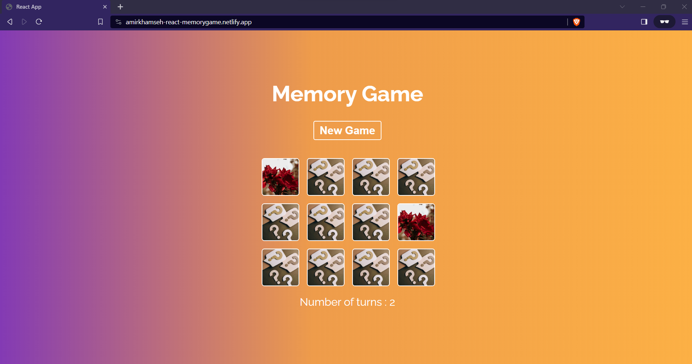

***Live demo :***  https://amirkhamseh-react-memorygame.netlify.app/
# Memory game 
Memory Game is a React-based front-end project designed to test players' memory skills. The game starts with 12 covered cards. The objective is to find the 6 pairs of matching cards. On each turn, the user has the option to uncover 2 cards. If the 2 cards match, they will remain uncovered and the player wins that round. If they do not match, both cards will be covered again within 0.5 seconds, and the player must remember the content of the cards for future turns. The game challenges players to win in the fewest number of turns possible.

# Technical objectives
This project focuses on utilizing React's capabilities to create components and enable communication between them. To achieve this, props and functional props are used to change the parent's state, useState is used to create and manage the value of states, useEffect is used to execute certain logic based on specific state changes, event handling is implemented to obtain desired user choices, and conditional rendering is used to apply certain styling or preview some components.

## Installation
- Make sure you have Node (v18.17.1 has been used on this project) installed on your system or download it from  https://nodejs.org/en. 

- Clone this repository or download the zip file .
- Open the terminal on the same directory and run the following commands to install the dependencies and run the project .
```
npm install
npm run start
```



